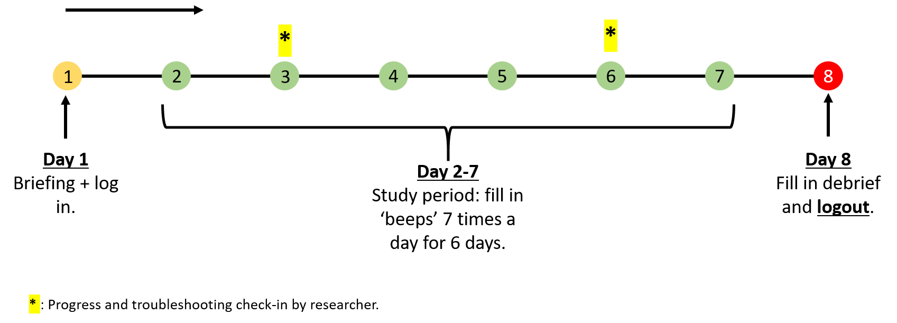
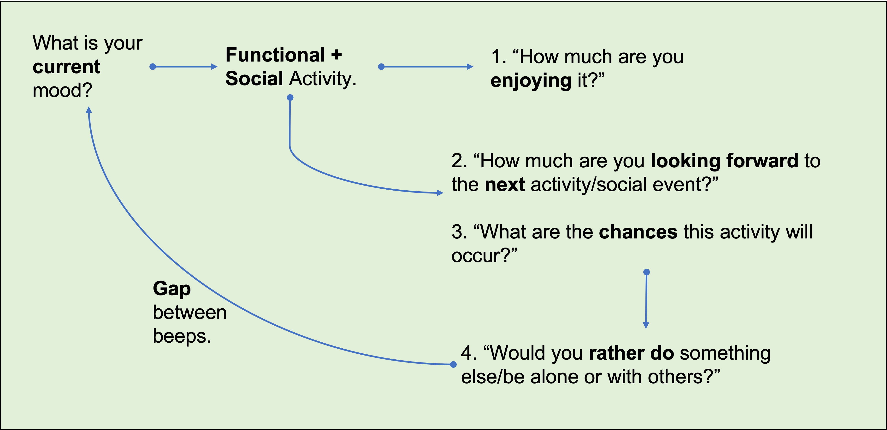

<body style="background-color:e4e4e4;"></body>

Jump to the [information section](README.md#this-is-a-study-being-conducted-by-the-nrg-lab-by-the-following-researchers)

 
<b>Bob contributed to scientific research. Bob is a superhero now. Be Bob.</b>
  
<h2>Pre-Screening Survey</h2> 

 If you qualify, we'll contact you!  
   
<iframe src="https://reading.onlinesurveys.ac.uk/smartphone_prescreening_survey" width="700" height="800"></iframe>
 

<!-- 
<iframe src="https://reading.onlinesurveys.ac.uk/contact_survey1" width="620" height="550"></iframe>
  -->

This page contains information about the SMARTPHONE study being conducted by the NRG lab, University of Reading.  

### This is a study being conducted by the <a href="https://www.nrg-lab.co.uk/" target="_blank">NRG-Lab</a> by the following researchers:
Prof. Ciara McCabe (<a href="mailto:c.mccabe@reading.ac.uk" target="_blank">c.mccabe@reading.ac.uk</a>) 

Angad Sahni, PhD Student (<a href="mailto:a.sahni@pgr.reading.ac.uk" target="_blank">a.sahni@pgr.reading.ac.uk</a>) 

Tarun Vermani, MSc Student (<a href="mailto:t.vermani@student.reading.ac.uk" target="_blank">t.vermani@student.reading.ac.uk</a>) 

Manasa Veluvali, MSc Student (<a href="mailto:m.veluvali@student.reading.ac.uk" target="_blank">m.veluvali@student.reading.ac.uk</a>)
 

<!--- You can skip to the [<u>instructions</u>](README.md#instructions).

 
 
 

Take Part!
 
 

  
 --->

 
 
 

# Instructions
<b>Contents:</b> 
- [Timeline](README.md#timeline)  
- [IMPORTANT](README.md#important) 
- [Beep Questionnaire](README.md#beep-questionnaire)  
- [Setting Up Your App](README.md#setting-up-your-app) 
 
 
 
 

### Timeline 
 
You will spend around <b>1-1.5 hours</b> completing the study over the 7-day period.
 
 

You need to be <b><u>SWITCHED ON</u></b> during this study because

<b>Every Beep Counts!</b>

 
 

 
 
<h3 style="color:red">IMPORTANT</h3>

1.	Fill in the beep questionnaire **immediately**. They are programmed to **expire**.  

2. You will receive the **debrief form** at around **10pm** on day 7.  
   - Please logout **AFTER** the debrief as you will not receive any more beeps. 
   - You **MUST** log out or else the data will not be sent. 

 
 

### Beep Questionnaire
  
 
You simply choose from a <b>set of options or rate using a scale</b>. 
 It takes just <b>1-2 minutes</b> to complete each time!  
 

 
 

### Setting Up Your App
**Step 1**  
Download the <b>PsyMate 2</b> application from one of the links below, based on which mobile type you are using:  
The **iPhone** link can be found here: <a href="https://apps.apple.com/gb/app/psymate-2/id1185231488" target="_blank">apple.com/gb/app/psymate-2</a>  
The **Android** link can be found here: <a href="https://play.google.com/store/search?q=psymate%202&c=apps&gl=GB" target="_blank">google.com/store/psymate2</a> 
More information is available on the PsyMate website: <a href="https://www.psymate.eu" target="_blank">psymate.eu</a>  
Or you can open the AppStore yourself and download the application by searching for <b>PsyMate 2</b> and looking for the logo:
 
 

  

 
 

**Step 2**  
Scan the **unique QR code** you will be given in the meeting. 

 
 

**Step 3** 
After completing the login process, you will then **complete all items**. 
The page will look like this:  
 
 

  

 
 

**Step 4**  
Settings in your smartphone may not be optimal for the study. 
Sometimes, notifications are **collected** on very active apps. 
This means you will **not be able to answer any beeps** as they will **expire** 
before you see the notifications.
 
 
To change settings accordingly, please visit: <a href="https://dontkillmyapp.com/" target="blank_">https://dontkillmyapp.com/</a>

 
 
 
 
 
 
 
 
 

<button onclick="topFunction()" id="myBtn" title="Go to top"><b>Top</b></button>

